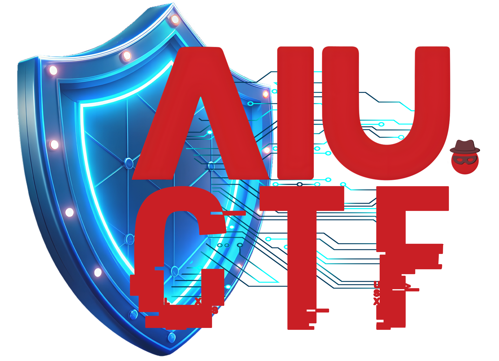

  

  # AIU CTF Community

  **[ Learn. Hack. Defend. ]**
   
   

  
    
  
  
  
  

---

## 🚩 Who We Are
**AIU CTF** is the official cybersecurity training community at **Alamein International University**. We are a student-run collective dedicated to bridging the gap between theoretical computer science and practical security skills.

Whether you are a complete beginner learning Linux for the first time or an experienced pentester, there is a place for you here.

## 🎯 Our Mission
> "Security is not a product, but a process."

We focus on **Capture The Flag (CTF)** competitions as a gamified way to learn:
* **Cryptography** (Breaking codes and ciphers)
* **Web Exploitation** (Finding vulnerabilities in websites)
* **Reverse Engineering** (Decompiling software to see how it works)
* **Binary Exploitation / Pwn** (Memory corruption and low-level hacking)
* **Digital Forensics** (Analyzing artifacts and logs)

## 📂 This Organization
This GitHub organization serves as our knowledge repository. Here you will find:

* **`/writeups`**: Solutions to challenges we have solved in global competitions.
* **`/training-materials`**: Code snippets, scripts, and workshops from our weekly sessions.
* **`/tools`**: Custom open-source tools developed by our members.

## 📅 Weekly Activities
* **Workshops:** Hands-on sessions covering specific tools (Burp Suite, Ghidra, Wireshark).
* **Internal CTFs:** Mini-competitions hosted for AIU students.
* **Global Raids:** We team up on weekends to compete in international CTFs on CTFtime.

## 🔗 Connect With Us
Stay updated with our latest events, writeups, and recruitment news.

* **📝 Registration Form:** [linktr.ee/AIUCTF](https://linktr.ee/AIUCTF)
* **💼 LinkedIn:** [company/aiu-ctf](https://www.linkedin.com/company/aiu-ctf)
* **📸 Instagram:** [@aiuctf](https://www.instagram.com/aiuctf/)
* **📘 Facebook:** [AIU CTF Community](https://www.facebook.com/people/AIU-CTF-Community/61584014913536/)
* **▶️ YouTube:** [@AIUCTF](https://www.youtube.com/@AIUCTF)

## 🤝 Code of Conduct
**White Hat Only.**
Everything taught and discussed in this community is for educational purposes and defensive security training. We have a zero-tolerance policy for malicious activity against university infrastructure or unauthorized systems.

---

  &copy; 2025 AIU CTF Community. Maintained by the Student Board.

